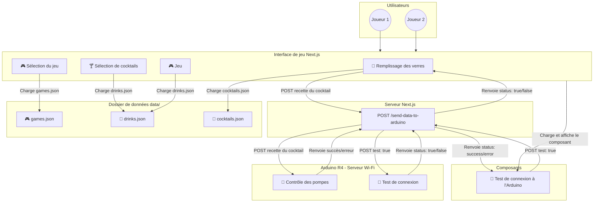

# Diagramme d'Architecture Système

```mermaid
graph TD
  subgraph Utilisateurs
    Player1((Joueur 1))
    Player2((Joueur 2))
  end

  subgraph Components [Composants]
    TestConnection[🔌 Test de connexion à l'Arduino]
  end

  subgraph Frontend [Interface de jeu Next.js]
    Serve[🧪 Remplissage des verres]
    SelectDrink[🍸 Sélection de cocktails]
    SelectGame[🎮 Sélection du jeu]
    Game[🎮 Jeu]
  end

  subgraph Backend [Serveur Next.js]
    API[POST /send-data-to-arduino]
  end

  subgraph Arduino [Arduino R4 - Serveur Wi-Fi]
    Pumps[🫗 Contrôle des pompes]
    TestResponse[🔄 Test de connexion]
  end

  subgraph Data [Dossier de données data/]
    GameData[🎮 games.json]
    DrinksData[🥤 drinks.json]
    CocktailData[🍹 cocktails.json]
  end

  Player1 --> Frontend
  Player2 --> Frontend
  API -->|Renvoie status: true/false| Serve
  Frontend -->|Charge et affiche le composant| TestConnection
  TestConnection -->|POST test: true| API
  API -->|Renvoie status: success/error| TestConnection
  TestResponse -->|Renvoie status: true/false| API
  API -->|POST test: true| TestResponse
  API -->|POST recette du cocktail| Pumps
  Pumps -->|Renvoie succès/erreur| API
  SelectDrink -->|Charge drinks.json| DrinksData
  SelectGame -->|Charge games.json| GameData
  Game -->|Charge drinks.json| DrinksData
  Serve -->|Charge cocktails.json| CocktailData
  Serve -->|POST recette du cocktail| API
```
